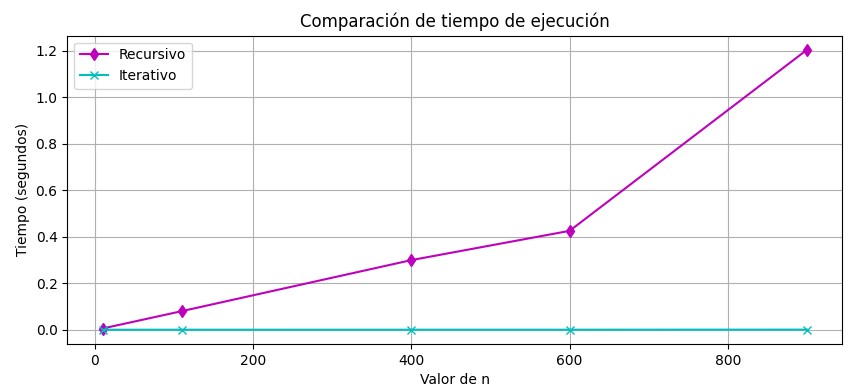
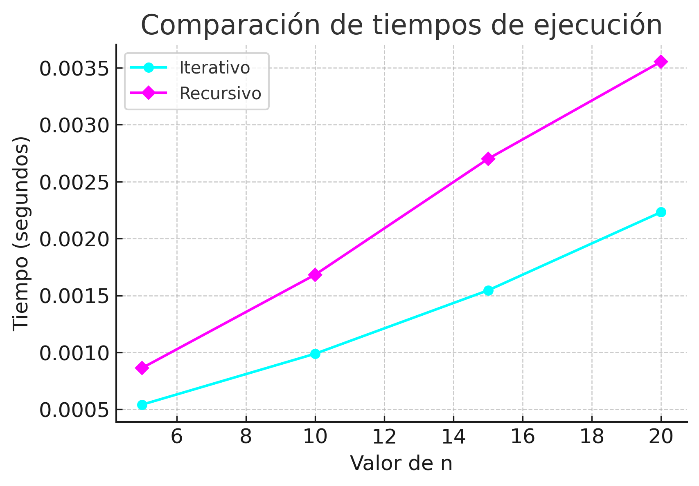
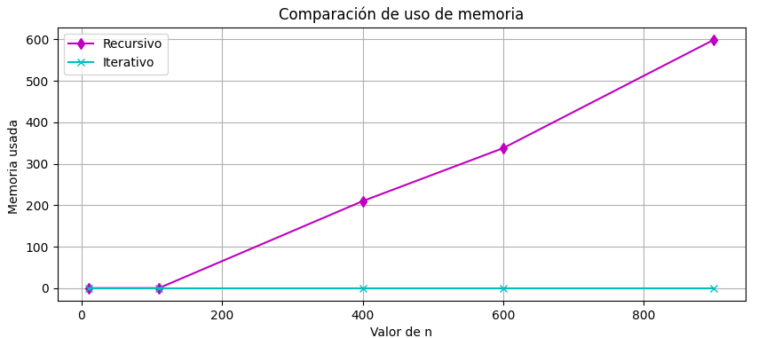
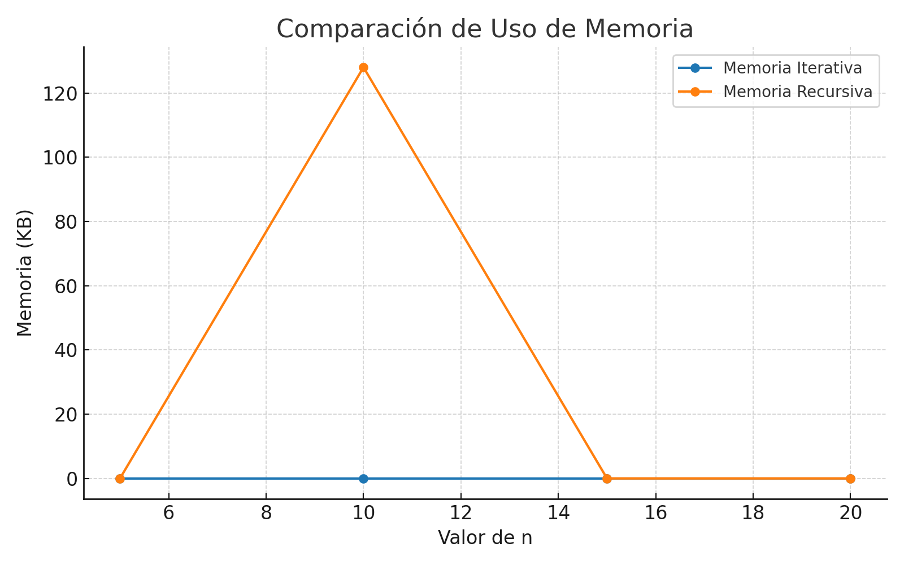

                                                                  # Comparación de eficiencia de algoritmos

# Propósito de la tarea: 
La idea central de esta tarea es comprender cómo la forma en que se implementa un algoritmo puede influir en su eficiencia. A través de la comparación entre una solución recursiva y otra iterativa para calcular factoriales. Para esto hice implementaciones en Python y en C, más allá de que ambas lleguen al mismo resultado, lo que me interesaba era medir y comparar qué tan rápido funcionan y cuánta memoria consumen. 

# Implementación de las funciones

 - Función Recursiva.
   
   La función recursiva se basa en que un factorial n se puede calcular como n * factorial(n-1), y que cuando n llega a 1 (o 0), el resultado es 1.
En mis códigos, además de hacer esta llamada recursiva, añadí una asignación de memoria extra (creando un arreglo temporal) para que el consumo de memoria fuera más visible al momento de medirlo.

- Función iterativa.
  La versión iterativa usa un bucle para multiplicar los números desde 1 hasta n, guardando el resultado en una variable. Igual que en la recursiva, incluí una reserva de memoria temporal para poder registrar su consumo de manera mas visible.

# Métodos usados para medir el tiempo de ejecución y la memoria.
Para medir cuánto tarda cada función en ejecutarse con distintos valores de n.
En Python:
Usé el módulo time. Antes de llamar a la función, guardé la hora de inicio (time.time()), y después de que terminara, guardé la hora de fin. Restar esos dos valores me dio el tiempo en segundos.
En C:
Usé la función clock() de la librería <time.h>. Aquí medí el tiempo total que tomaba ejecutar la función muchas veces seguidas (definido por TIME_REPS) para obtener un valor más estable.

Ahora para ver cuánta memoria consumía cada versión, forcé a las funciones a reservar memoria extra temporalmente (los arreglos temp en Python y malloc en C). Así, la medición sería más visible.
En Python:
Usé la librería memory_profiler y la función memory_usage(), que me devuelve una lista con el uso de memoria en cada instante. Restar el valor mínimo al máximo me dio el consumo adicional.
En C:
Utilicé la función getrusage() (de <sys/resource.h>) para obtener el máximo de memoria residente (ru_maxrss) antes y después de ejecutar la función. 

# Resumen de hallazgos y comparaciones gráficas.
1. Tiempo de ejecución
En general, la función iterativa fue más rápida que la recursiva, sobre todo cuando n fue grande. Esto se debe a que la recursión implica muchas llamadas a funciones, y cada llamada añade una pequeña sobrecarga de tiempo.

Como se muestra en la imagen
Python: 

C:

2. Uso de memoria
La versión recursiva consumió más memoria, porque cada llamada crea su propio espacio en la pila de ejecución (stack). La iterativa, en cambio, solo usa un bucle que reutiliza las mismas variables.
En este caso, la diferencia fue evidente porque en el código se forzó un consumo extra de memoria en ambas funciones, lo que permitió medirlo observando un poco mejor.

Python:

C:

